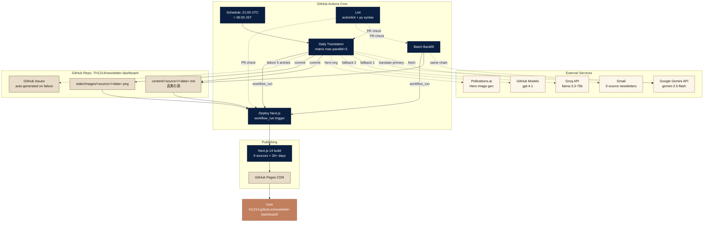
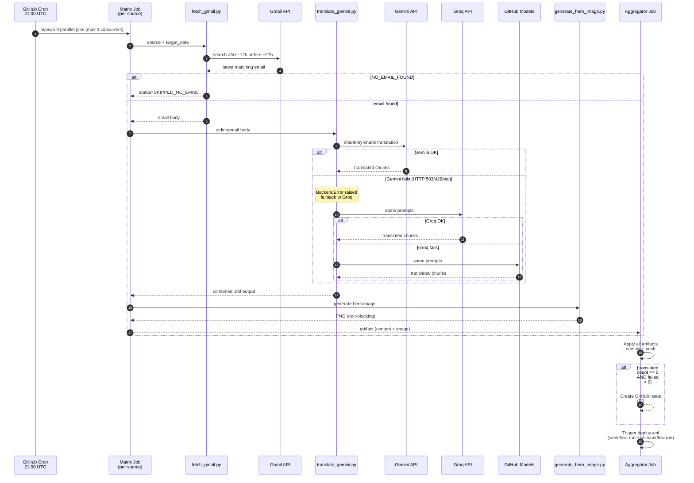
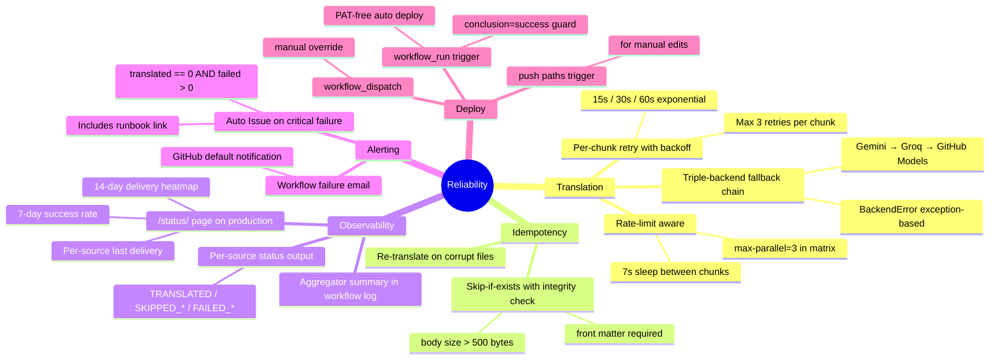
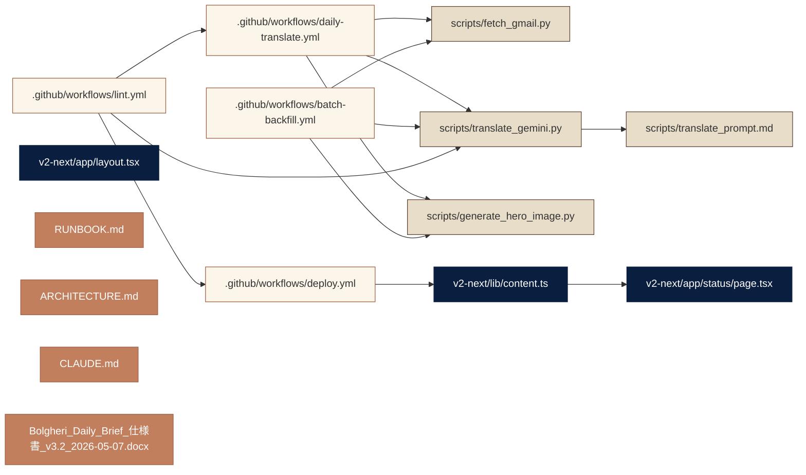

# Bolgheri Daily Brief — Architecture

P3 #13 として 2026-05-07 fix 後の最新アーキテクチャを Mermaid 形式で可視化。

最終更新: 2026-05-07

---

## 1. システム全体像



## 2. Translation pipeline (single source detail)



## 3. Reliability features (2026-05-07 後の状態)



## 4. Date window logic (P0 #1 fix - 2026-05-07)

```mermaid
gantt
    title fetch_gmail.py date_override window evolution
    dateFormat HH:mm
    axisFormat %H:%M
    
    section Old (before fix)
    Window for 2026-05-07 :crit, old, 00:00, 27h
    
    section New (-12h expansion)
    Window for 2026-05-07 :active, new, -12h, 39h
    
    section Email arrivals (UTC, sample)
    WSJ 10:09 UTC :milestone, 10:09, 0min
    DealBook 11:51 UTC :milestone, 11:51, 0min
    Skift 11:45 UTC :milestone, 11:45, 0min
    Short Squeez 08:31 UTC :milestone, 08:31, 0min
```

注釈: 5/6 の典型的配信時刻 (UTC) は 08:00〜16:00。旧ウィンドウ (5/7 00:00 JST = 5/6 15:00 UTC 以降) では先頭の 5/6 朝着メールを取り逃がしていた。新ウィンドウ (5/6 12:00 JST = 5/6 03:00 UTC 以降) で完全カバー。

## 5. ファイルマップ (主要)


